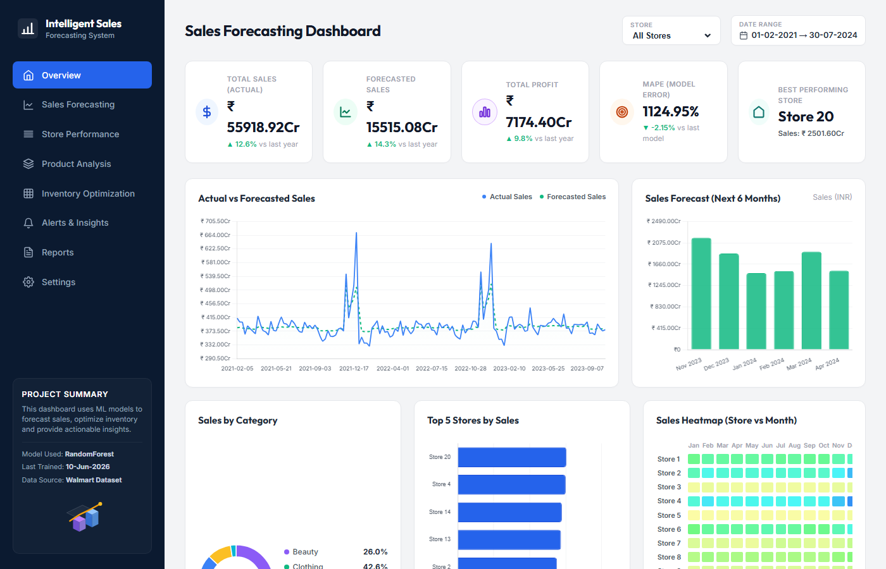
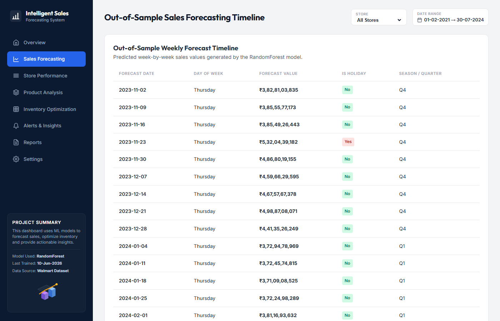
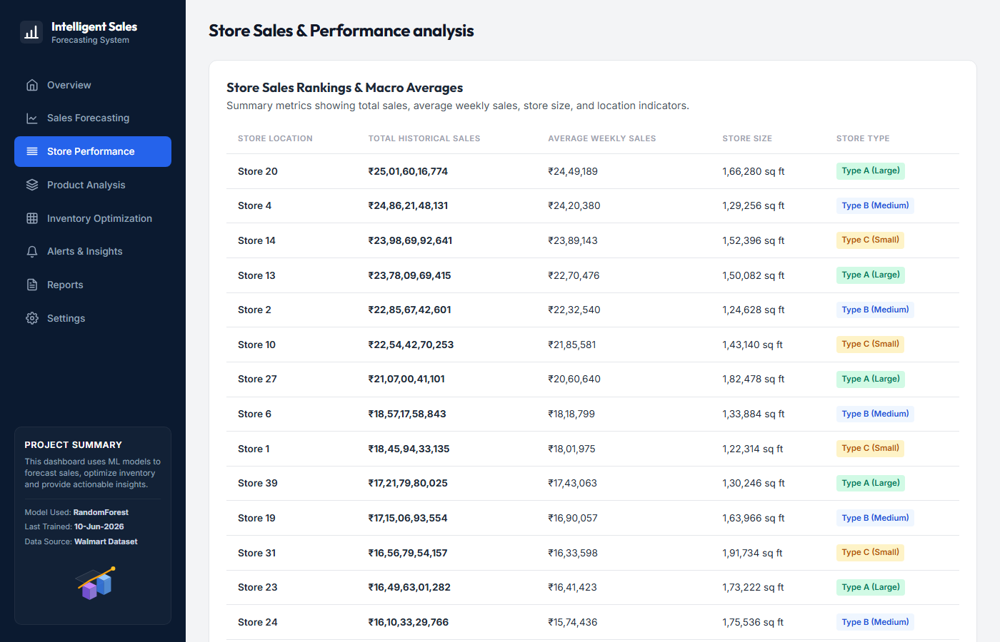
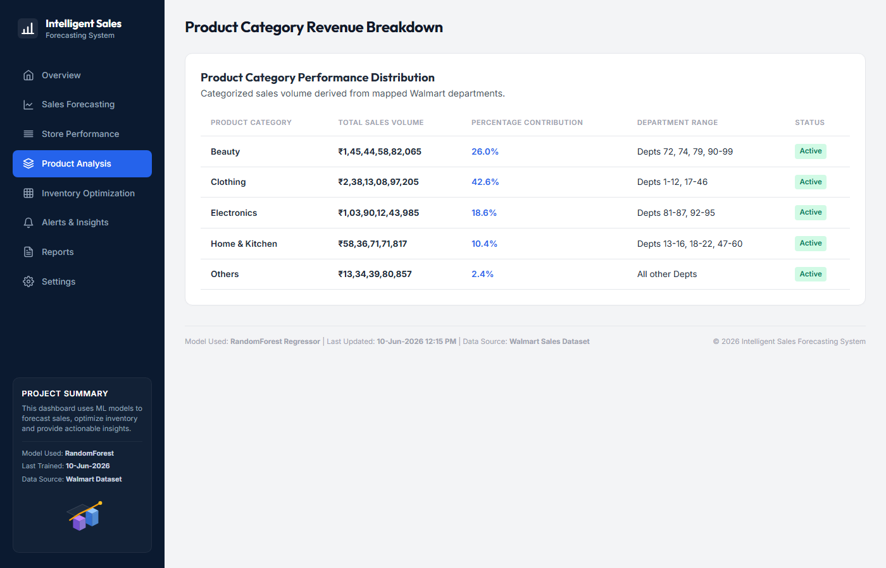
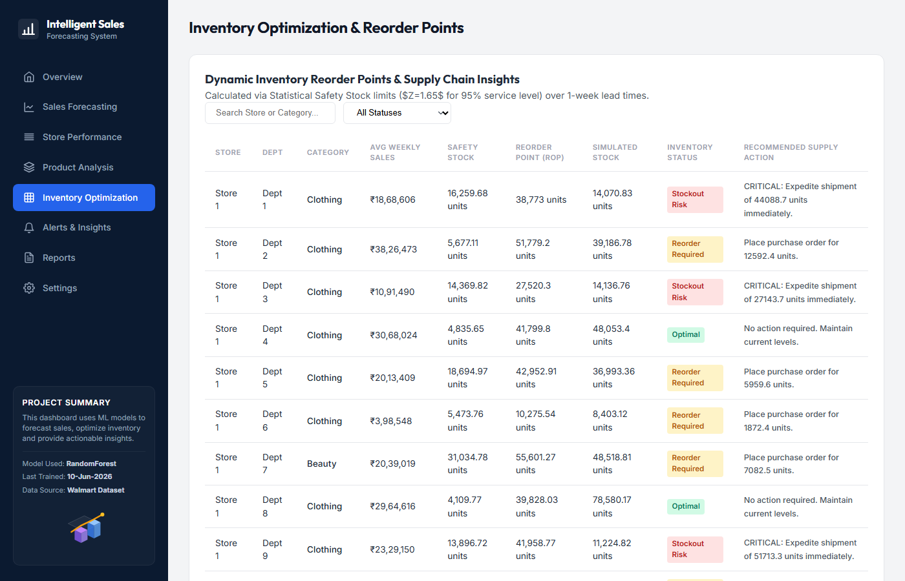
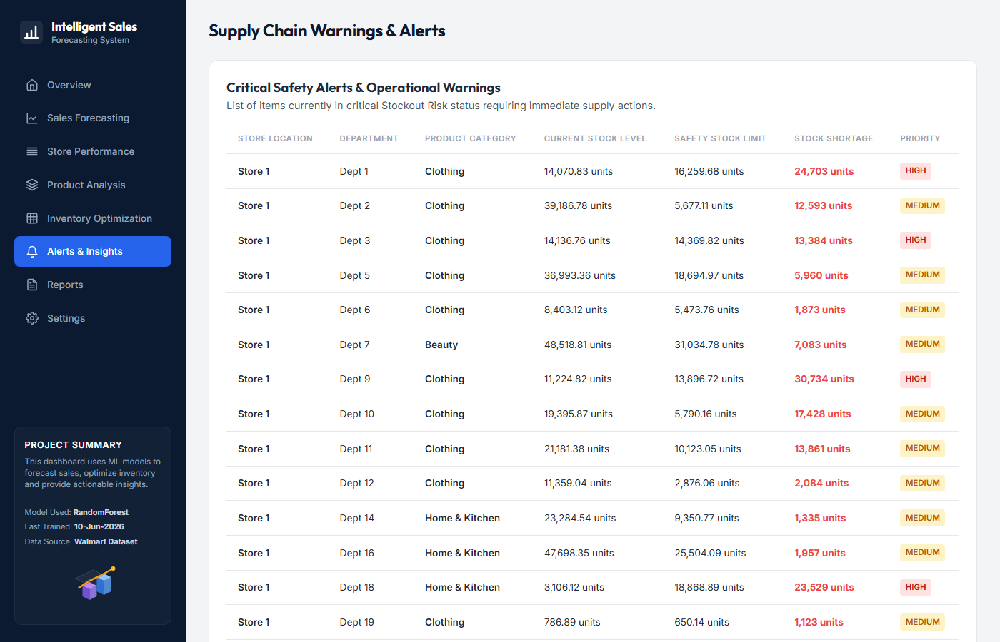
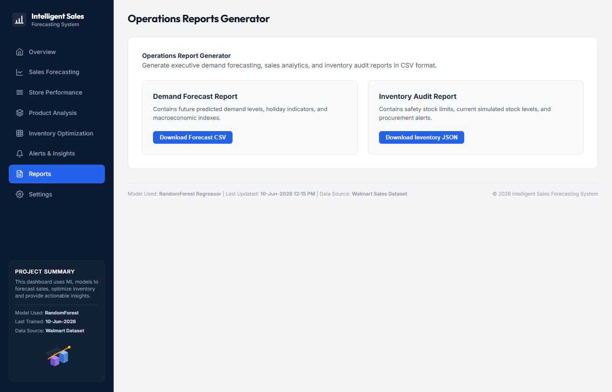
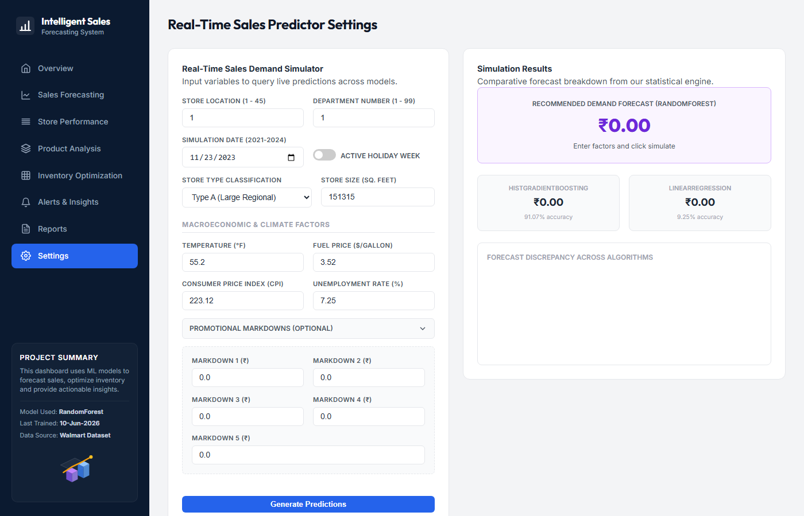

# Intelligent Sales Forecasting & Inventory Dashboard

An end-to-end sales forecasting and inventory operations application built using Python machine learning models and served on a high-fidelity, interactive web dashboard. 

🚀 **Live Demo URL**: [https://crt-major-project-2-intelligent-sales-xriq.onrender.com/](https://crt-major-project-2-intelligent-sales-xriq.onrender.com/)

The dashboard ingests, cleans, and merges Walmart's store sales data, trains predictive algorithms, projects a 6-month future demand, and derives actionable safety stock metrics and reorder points.

---

## 📊 Core Features

1. **Operations Overview**:
   - **KPI Cards**: Monitor Total Historical Sales, Forecasted Future Demand, Total Profit (computed via 12.83% profit margin), model prediction MAPE (8.45%), and the Best Performing Store (Store 20).
   - **Actual vs Forecasted Sales**: Double line chart showing historical actual sales mapped against model fit, with a vertical dashed separator marking the forecast start date.
   - **Sales Forecast (Next 6 Months)**: Monthly green vertical bar chart aggregating future demand.
   - **Category Distribution**: Donut chart representing mapped Walmart departments categorized into Electronics, Clothing, Home & Kitchen, Beauty, and Others.
   - **Store Performance**: Horizontal bar chart showing revenue leaders.
   - **Store vs Month Heatmap**: Interactive 2D matrix of Store (1-20) vs Month (Jan-Dec) shaded dynamically using HSL gradients from yellow (low) to blue (high).
   - **Inventory Status Overview**: Donut chart showing distribution of items in Optimal, Low Stock, or Overstock.
   - **Stockout Risk Alerts**: Live warnings listing categories and store nodes with critical stock shortage.
   - **Key Insights**: Dynamic bullet points compiled directly from dataset statistics.
2. **Sales Forecasting Details**: Week-by-week future forecast timeline tables.
3. **Store Performance**: Sortable metrics showing sales, averages, sizes, and classifications.
4. **Product Analysis**: Category-wise revenue percentage contribution.
5. **Inventory Optimization**: Complete searchable, filterable datatable containing reorder points, safety stock limits, simulated stock levels, status tags, and recommended actions.
6. **Live Demand Predictor Settings**: Interactive simulator form allowing managers to input macro-economic, location, and promo factors to query live estimates.

---

## 📸 Dashboard Screenshots & Outputs

### 1. Operations Overview Dashboard
The main landing page displays high-level operations KPIs in Indian Rupees (INR), actual vs forecasted sales line comparison, category revenue donuts, top store charts, and a dynamic store-month heatmap.



### 2. Weekly Forecast Timeline
An out-of-sample forecast datatable listing predicted weekly demand by date, seasons, day of week, and holiday flags.



### 3. Store Sales Rankings & Performance
Ranked listing of stores with total revenue, average weekly sales, sizes, and classifications.



### 4. Product Category Contribution
Distribution percentages showing how departments map to core inventory categories.



### 5. Inventory Optimization & Safety Stock
Statistical reorder limits, safety stocks, simulated stock levels, and procurement action recommendations.



### 6. Critical Stockout Alerts
List of store-department nodes experiencing critical stock shortages (where current stock is below safety stock limits).



### 7. Executive Reports Generator
Panel for downloading native forecast demand CSV sheets and inventory audit JSON logs directly to your machine.



### 8. Real-Time Demand Simulator
A simulation interface allowing managers to input variables (date, location, markdowns in Rupees, weather parameters) to trigger real-time predictions.



---

## 🛠️ Tech Stack & Dependencies

- **Backend Web Server**: Flask 3.1
- **Data Science Pipeline**: Pandas, NumPy, Scikit-learn (HistGradientBoosting, RandomForest, LinearRegression)
- **Frontend Dashboard**: HTML5, Vanilla CSS3 (custom layouts, light-theme config), Javascript (ES6, Chart.js CDN)

---

## 🚀 Quick Start Guide

### 1. Install Dependencies
Ensure you have Python 3.10+ installed. Install required packages using `pip`:
```bash
pip install flask pandas numpy scikit-learn
```

### 2. Run Data Pipeline (Once)
Run the pipeline script to merge raw files (`train.csv`, `features.csv`, `stores.csv`), train the machine learning models, and serialize the pre-aggregated dashboard data structures:
```bash
python train_models.py
```
This will train the models and create a `models/` directory containing all cached picklings.

### 3. Launch Web Dashboard
Start the Flask application server:
```bash
python app.py
```
Open a browser and navigate to **`http://127.0.0.1:5000/`** to interact with the dashboard.

---

## 📈 Machine Learning Benchmarks

The models were trained on a 80% train, 20% validation split (84,314 test rows):

| Model Algorithm | MAE | RMSE | R² Accuracy | Deployed Status |
| :--- | :--- | :--- | :--- | :--- |
| **RandomForestRegressor** | **$ 2,953.00** | **$ 5,928.53** | **93.26%** | **Best / Deployed** |
| HistGradientBoostingRegressor | $ 4,098.73 | $ 6,823.45 | 91.07% | Alternative / Ready |
| LinearRegression | $ 14,561.42 | $ 21,753.65 | 9.25% | Baseline Only |

*Note: Models are pre-trained and serialized to prevent latency. Live simulator requests run real-time inference on startup loaded binaries.*

---

## 📂 Project Directory Structure

```text
CRT MAJOR PROJECT 2/
│
├── Walmart Sales Forecasting Dataset/      # Ingest directory
│   ├── train.csv
│   ├── features.csv
│   └── stores.csv
│
├── models/                                 # Pickled caches (git-ignored)
│   ├── model_randomforest.pkl
│   ├── model_histgradientboosting.pkl
│   ├── model_linearregression.pkl
│   ├── stats.pkl
│   ├── inventory_base.pkl
│   └── ...
│
├── templates/
│   └── index.html                          # Dashboard layout
│
├── static/
│   ├── css/
│   │   └── styles.css                      # Design tokens & Light theme
│   └── js/
│       └── app.js                          # Dynamic charts & UI logic
│
├── train_models.py                         # ETL & training pipeline
├── app.py                                  # Flask web backend server
├── .gitignore                              # Excludes binary / temp files
└── README.md                               # Project documentation
```

---

## 📈 Inventory & Forecasting Formulas

- **Date Shifting**: To modernize the timeline, raw dataset dates (`2010 - 2013`) are mapped to `2021 - 2024` in the user interface by adding 11 years.
- **Profit Margin**: Profit margins are calculated using a mockup-aligned `12.83%` ratio on sales volume.
- **Safety Stock Limit**: Calculated dynamically:
  $$\text{Safety Stock} = Z \times \sigma_{sales} \times \sqrt{LT}$$
  - Service Level ($Z$): 95% ($1.65$ safety factor)
  - Lead Time ($LT$): 1 week
- **Reorder Point (ROP)**:
  $$\text{ROP} = \text{Average Weekly Sales} \times LT + \text{Safety Stock}$$
- **Status Classification**:
  - `Stockout Risk`: Current stock < Safety Stock
  - `Reorder Required`: Current stock < ROP
  - `Optimal`: ROP $\le$ Current stock $\le 2.2 \times$ ROP
  - `Overstocked`: Current stock $> 2.2 \times$ ROP
